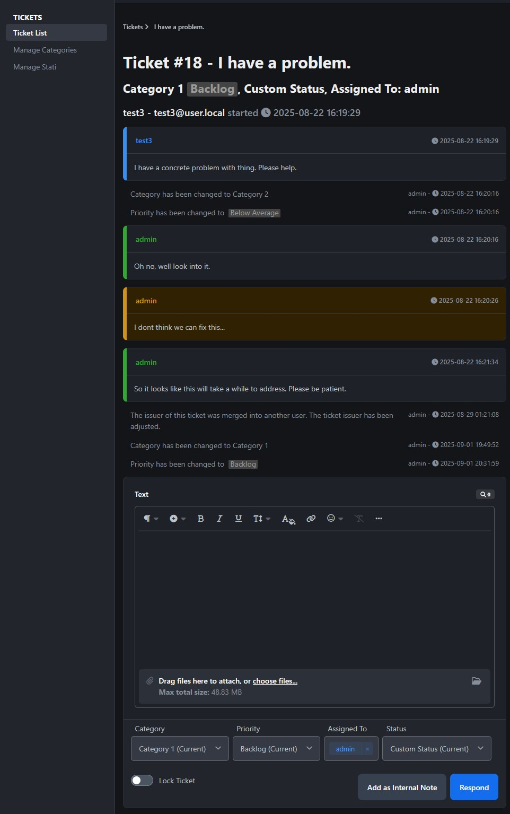
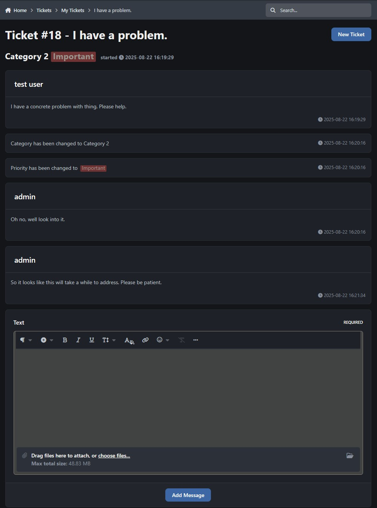

# Anego Studios's Support Application

This repository holds the source code for our support ticket system. 

While the source is publicly available, PRs will generally be ignored. For now this repository is only source available.

If you have concerns, security related or otherwise, feel free to [contact us](https://www.vintagestory.at/support/).

## Features

- Tickets
	- General features
		- Attachments
		- Editor autosaves
		- Priorities (-2 to 2, currently not extendable) (translatable)
		- Arbitrary Categories (translatable)
		- Timestamps on tickets and messages
		- Friendly urls (mostly, tickets are still referenced by id)
		- Action tracking (history of attribute changes)
		- Notifications / Emails for
			- New responses
			- Newly created tickets if the issuer is not logged in
	- Migration tool to transfer Invision Community 4 tickets 
		- Categories (prev. Departments)
		- Stati
		- Tickets
			- Attributes (Category, Priority, Status, Assigned Staff)
			- Messages, including Internal Notes
			- some of the Action log
		- Staff preferences for default reply
	- Frontend module
		- Create new tickets (also possible as guest)
		- Inspect individual tickets
			- Add more messages / Reply to the ticket if it is not locked
		- List of tickets created by current member
			- Read markers
		- Tickets are not enumerable
		- Requires captcha if enabled
	- Admin module
		- View all tickets
			- Read markers
		- View individual ticket
			- Reply or add Internal Note and
				- Change Status
				- Change Category
				- Change Priority
				- Lock to staff members
				- Assign to specific staff member
			- Manage Customer Purchases without leaving the ticket
				- Inspect or Cancel / Reinstate
			- Manage Customer Invoices largely without leaving the ticket
				- Inspect, Track, Cancel, Refund, Resend or Delete
				- opens in new tab: Edit or Print
			- Staff member preferences
				- Set your default reply template
				- Per device history flow direction
		- Create / Edit / Delete Ticket Categories
			- Preview translated names
			- Set per category disclaimers shown in frontend
		- Create / Edit / Delete new Ticket Stati
			- Some stati are builtin and cannot be removed
			- Preview translated names
		- ACP Profile block showing member ticket history
		- Settings for email ingress (currently IMAP only)

### Screenshots

  
Creating a ticket in the frontend.

  
Listing tickets in the backend (some features are WIP).

  
Viewing and responding to a ticket in the backend.

  
Viewing and responding to a ticket from the frontend.

  
Managing purchase information of affected customer.

  
Without leaving the ticket for most actions.

## TODO

- Migrate ticket attachments
- GitHub linking
- GitLab linking
- Fix AdminCP not highlighting the correct menu item
- MFAArea Extension ?
- Option to delete open tickets when issuer gets deleted.
- Better user change tracking
	- User name change tracking is flaky
- Admin bulk actions
- Allow notification merging
- Migration: empty_local_data ?
- Get the in system/Email/Outgoing/Smtp.php:221 that prevents settings custom `Message-id`'s fixed.

## License

The code and other files in this repository are provided under the MIT license unless specified otherwise.
